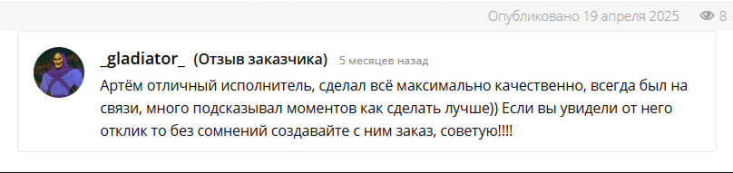

# $\color{darkred}\textsf{ohShitMyCodeBroken}$

$\color{red}\text{Фриланс-проект}$

## $\color{mediumblue}\text{Описание работы }$:

Вёрстка внешней части многостраничного сайта для аренды игровых аккаунтов.

<u>**Основное техническое задание</u>** :

📌 Разработать вёрстку главной страницы по макету в двух состояниях:

    	✔ При наличии у пользователя аренды аккаунта (карточка с активной арендой).

    	✔ При отсутствии активных аренд аккаунтов.

📌 Сверстать страницу с ответами на часто задаваемые вопросы (аккордеон с вопросами и ответами).

📌 Сверстать страницу описания проблем, возникающих при аренде аккаунта (аналогичный аккордеон, как на странице FAQ).

_Дополнительно: Заказчик запросил консультацию по отображению блоков в мобильной версии._

🎯 $\color{mediumblue}\textsf{Основная задача}$ - "Нужно сверстать по макету три страницы".

---

Макет -> [**Figma**](https://www.figma.com/design/T9px9tcwH7udypP1OVD3bV/Baze--Copy-?node-id=0-1&p=f&t=6XqWKnxfptgZ2ojT-0)

Вёрстка -> [**Git Pages**](https://artiom-work.github.io/broken-game-code/index.html)

Портфолио фриланс платформы -> [**Kwork**](https://kwork.ru/portfolio/16563515)

---

## $\color{mediumblue}\text{Технологии, инструменты и способы вёрстки }$:

✅ Sass
✅ БЭМ
✅ Flexbox
✅ Валидная вёрстка
✅ Адаптивная вёрстка
✅ Семантическая вёрстка
✅ Кросс-браузерная вёрстка
✅ Оптимизация загрузки
✅ SVG Sprites
✅ Git
✅ Figma
✅ VS Code
✅ Формы и валидация (HTML+CSS+JS)
✅ Модальные окна (HTML+CSS+JS)
✅ Мобильное «бургер-меню» (HTML+CSS+JS)
✅ Аккордеон (HTML+CSS+JS)
✅ Кнопка "день/ночь" (HTML+CSS+JS)
✅ Шаблонизация HTML элементов (JS)
✅ jQuery
✅ iziModal
✅ Hover/active-эффекты
✅ Анимации (CSS)
✅ Простой параллакс-эффект (HTML+CSS+JS)
✅ "Живой фон" — анимация (HTML+CSS+JS)

---

### $\color{mediumblue}\textbf{Результат работы:}$

$\color{orange}\textbf{✔ Все задачи из основного технического задания выполнены.}$

---

### $\color{lightgreen}\text{Описание выполненных работ, включая дополнительные:}$

$\color{orange}\textsf{✔ Карточки активных арендных аккаунтов:}$

    ➡ JS-шаблонизация блоков "карточек".
    ➡ Кнопка "Скопировать" в каждой карточке.
    ➡ Функционал копирования данных из data-атрибута.
    ➡ Кастомное сообщение об успешном копировании (CSS + JS).

$\color{orange}\textsf{✔ Модальное окно ( библиотека iziModal ) на всех страницах, для создания новой аренды аккаунта:}$

_По просьбе заказчика реализована валидация поля ввода для активации активного аккаунта._

    	➡ Маска формата UUID v4
    	➡ Валидация формата UUID v4
    	➡ Стандартное браузерное сообщение с кастомным текстом о невалидности записи в поле.
    	➡ Цвет рамки поля в соответствии с валидностью заполнения.

$\color{orange}\textsf{✔ Мобильное "бургер"-меню (CSS + JS).}$

$\color{orange}\textsf{✔ Аккордеоны на страницах FAQ и "Проблема" (библиотека jQuery)}$

$\color{orange}\textsf{✔ CSS-анимация всех декоративных фоновых изображений на всех страницах.}$

$\color{orange}\textsf{✔ Реализация кнопки "день/ночь" на сайте.}$

    	➡ Ориентируется на время суток.
    	➡ Ориентируется на тему пользователя в его ОС/браузере.
    	➡ Запоминает выбор темы пользователя при переходе по страницам.

$\color{orange}\textsf{✔ Реализован "живой" фон на странице (CSS + JS).}$

    ➡ Динамическое добавление "звёзд" в HTML.
    ➡ Функциональность мерцания "звёзд".
    ➡ Простой параллакс-эффект в компьютерной версии.

$\color{orange}\textsf{✔ Добавлены эффекты наведения и нажатия на элементы взаимодействия.}$

---

### $\color{Green}\textsf{ Продолжение работы над проектом вне рамок первоначального заказа. }$

$\color{lightgreen}\textsf{✔ Создание прелоудера .}$

    ➡ Анимация прелоудера (HTML/CSS).
    ➡ Декоративная функция для отображения при загрузке страниц ( удалить или исправить при необходимости в рабочем варианте) (JS)

$\color{lightgreen}\textsf{✔ Вёрстка дополнительного модального окна (для продления аренды).}$

#### $\color{lightblue}\textsf{ Список ключей в формате UUID v4 для добавления карточеи аренды ( для примера ):}$

    a90aa8b8-c3b2-4878-8383-4793677f51bf

    f47ac10b-58cc-4372-a567-0e02b2c3d479

    b1a0e9c2-3f8d-4b1a-9c2d-3e4f5a6b7c8d

    7c9e2f4a-8b1c-5d3e-6f7a-8b9c0d1e2f3a

    d3e4f5a6-7b8c-9d0e-1f2a-3b4c5d6e7f8a

    a1b2c3d4-5e6f-7a8b-9c0d-1e2f3a4b5c6d

    e5f6a7b8-9c0d-1e2f-3a4b-5c6d7e8f9a0b

    9c8b7a6f-5e4d-3c2b-1a0f-9e8d7c6b5a4f

    4d3c2b1a-0f9e-8d7c-6b5a-4f3e2d1c0b9a

    8f7e6d5c-4b3a-2f1e-0d9c-8b7a6f5e4d3c
