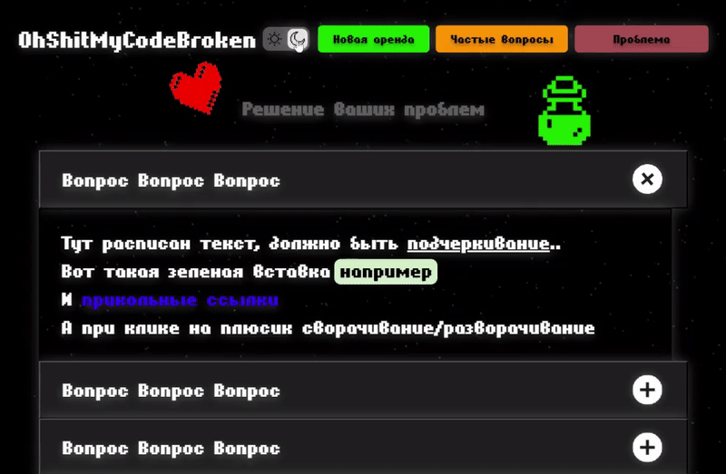

# $\color{turquoise}\textsf{ohShitMyCodeBroken}$

$\color{red}\text{Заказ с фриланс-биржи		}$

## $\color{mediumblue}\text{Описание работы }$:

Внешняя часть многостраничного сайта для аренды игровых аккаунтов.

<u>**Основное техническое задание</u>** :

📌 Сверстать главную страницу по макету в двух состояниях:

    	✔ При наличии у пользователя аренды аккаунта (карточка с активной арендой).

    	✔ При отсутствии активных аренд аккаунтов.

📌 Сверстать страницу с ответами на часто задаваемые вопросы (аккордеон с вопросами и ответами).

📌 Сверстать страницу описания проблем, возникающих при аренде аккаунта (аналогичный аккордеон, как на странице FAQ).

_Дополнительно: Заказчик запросил консультацию по отображению блоков в мобильной версии._

🎯 $\color{mediumblue}\textsf{Основная задача}$ - "Нужно сверстать по макету три страницы".

---

Макет -> [**Figma**](https://www.figma.com/design/T9px9tcwH7udypP1OVD3bV/Baze--Copy-?node-id=0-1&p=f&t=6XqWKnxfptgZ2ojT-0)

Вёрстка -> [**Git Pages**](https://artiom-work.github.io/broken-game-code/problem.html)

Рабочая версия -> [**Ссылка на сайт**]()

$\color{orange}\textit{Извините, по требованию заказчика работа временно не доступна для публикации до официального запуска сайта...}$

---

## $\color{mediumblue}\text{Технологии, инструменты и способы вёрстки }$:

✅ Sass
✅ БЭМ
✅ Flexbox
✅ Валидная вёрстка
✅ Адаптивная вёрстка
✅ Семантическая вёрстка
✅ Кросс-браузерная вёрстка
✅ Оптимизация загрузки
✅ SVG Sprites
✅ Git
✅ Figma
✅ VS Code
✅ Формы и валидация (HTML+CSS+JS)
✅ Модальные окна (HTML+CSS+JS)
✅ Мобильное «бургер-меню» (HTML+CSS+JS)
✅ Аккордеон (HTML+CSS+JS)
✅ Кнопка "день/ночь" (HTML+CSS+JS)
✅ Шаблонизация HTML элементов (JS)
✅ jQuery
✅ iziModal
✅ Hover/active-эффекты
✅ Анимации (CSS)
✅ Простой параллакс-эффект (HTML+CSS+JS)
✅ "Живой фон" — анимация (HTML+CSS+JS)

---

### $\color{mediumblue}\textbf{Результат работы:}$

$\color{orange}\textbf{✔ Все задачи из основного технического задания выполнены.}$

---

### $\color{lightgreen}\text{Описание выполненных работ, включая дополнительные:}$

$\color{orange}\text{✔ Карточки активных арендных аккаунтов:}$

    ➡ JS-шаблонизация блоков "карточек".
    ➡ Кнопка "Скопировать" в каждой карточке.
    ➡ Функционал копирования данных из data-атрибута.
    ➡ Кастомное сообщение об успешном копировании (CSS + JS).

$\color{orange}\text{✔ Модальное окно ( библиотека iziModal ) на всех страницах, для создания новой аренды аккаунта:}$

_По просьбе заказчика реализована валидация поля ввода для активации активного аккаунта._

    	➡ Маска формата UUID v4
    	➡ Валидация формата UUID v4
    	➡ Стандартное браузерное сообщение с кастомным текстом о невалидности записи в поле.
    	➡ Цвет рамки поля в соответствии с валидностью заполнения.

$\color{orange}\text{✔ Мобильное "бургер"-меню (CSS + JS).}$

$\color{orange}\text{✔ Аккордеоны на страницах FAQ и "Проблема" (библиотека jQuery)}$

$\color{orange}\text{✔ CSS-анимация всех декоративных фоновых изображений на всех страницах.}$

$\color{orange}\text{✔ Реализация кнопки "день/ночь" на сайте.}$

    	➡ Ориентируется на время суток.
    	➡ Ориентируется на тему пользователя в его ОС/браузере.
    	➡ Запоминает выбор темы пользователя при переходе по страницам.

$\color{orange}\text{✔ Реализован "живой" фон на странице (CSS + JS).}$

    ➡ Динамическое добавление "звёзд" в HTML.
    ➡ Функциональность мерцания "звёзд".
    ➡ Простой параллакс-эффект в компьютерной версии.

$\color{orange}\text{✔ Добавлены эффекты наведения и нажатия на элементы взаимодействия.}$

---

### $\color{Green}\text{ Продолжение работы над проектом вне рамок первоначального заказа. }$

$\color{lightgreen}\text{✔ Создание прелоудера .}$

    ➡ Анимация прелоудера (HTML/CSS).
    ➡
    ➡

$\color{lightgreen}\text{✔ Вёрстка дополнительного модального окна (для продления аренды).}$

    ➡ .
    ➡ .
    ➡ .
